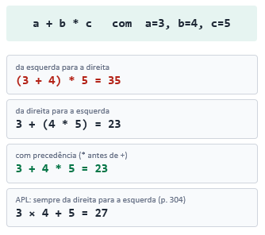
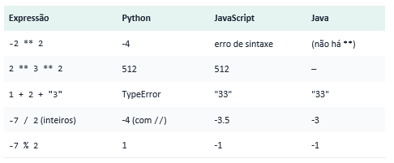
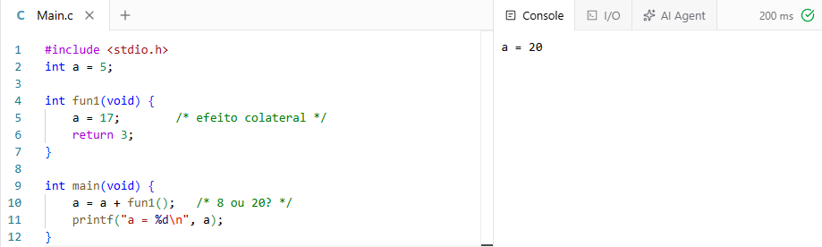

# Relatório Exploratório - Aula 007 (5 - )

## Slide 5

Realiza algumas perguntas que serão respondidas nos slides seguintes, sendo perguntas como:

- Quais são as regras de precedência?
- Quais são as regras de associatividade?
- Em que ordem os operandos são avaliados?
- Há restrições a efeitos colaterais?
- O usuário pode sobrecarregar operadores?
- Que mistura de tipos é permitida?

Mostra um exemplo de diferentes saídas, variando de acordo com precedência e direção.



E também menciona a excessão feita no List quanto à precedência. Explica que no _Lisp_ os parênteses indicam a ordem, e a notação é prefixa (Operador antes dos operandos)

## Slide 6

Mostra uma matriz relacional entre diferentes expressões e suas saídas em diversas linguagens. Também faz a sugestão do uso de parênteses para deixar o código mais legível, tanto para o programador, quanto para o compilador.



## Slide 7

**Exemplo de código:**
```c
#include <stdio.h>
int a = 5;

int fun1(void) {
    a = 17;        /* efeito colateral */
    return 3;
}

int main(void) {
    a = a + fun1();   /* 8 ou 20? */
    printf("a = %d\n", a);
}
```

**Saída:**
```bash
a = 20
```



Neste slide é exibido um código exemplar em _C_.

O slide evidência a diferença dos resultados baseando-se na ordem dos operandos, dado os efeitos colaterais.